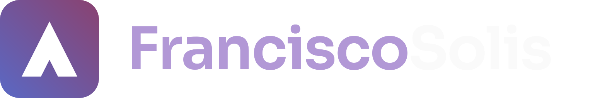
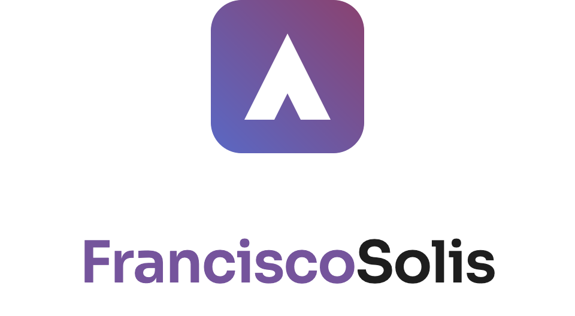

# FranciscoSolis — Visual Identity

B2B software for businesses of every size: appointments, quotes, signatures, change requests.
Trusted, precise, intelligent — enterprise-ready without feeling cold.

The live version of this document is the site's own `/brand` page, which renders every mark from the
same components the app ships. This file is the written source; keep the two in step.

## The mark

An upward peak cut from a rounded tile: a summit (growth), a checkmark echo (approval — quotes
signed, appointments confirmed), and an F/S ligature reduced to pure geometry. The tile carries the
brand gradient; the peak is always white.

The tile's corners are rounded at **20% of its edge**, uniformly — the same ratio on all four
corners and at every size, so the curve reads the same in a 16 px favicon and a 1024 px export.
It is deliberately under the ~22% masks iOS and Android apply on top of an app icon: anywhere a
platform rounds or crops the artwork itself, ship `fs-mark-square` — the full-bleed tile with no
rounding — rather than letting it re-cut corners that are already rounded, which is what leaves the
mark looking clipped.


On dark surfaces:



Vertical, for square placements and splash screens:



## Lockups & assets

| Asset | Use |
|---|---|
| `fs-lockup-horizontal` | Website header, docs, email signatures (light) |
| `fs-lockup-horizontal-dark` | Same, on dark surfaces |
| `fs-lockup-vertical` | Square placements, splash screens (light) |
| `fs-lockup-vertical-dark` | Same, on dark surfaces |
| `fs-mark` | App icon, avatar, favicon |
| `fs-mark-square` | Full-bleed, no rounding — platforms that round or crop the icon themselves |
| `fs-mark-mono-ink` / `-white` | Single-color contexts (print, engraving, watermarks) |
| `fs-avatar-circle` | Platforms that force circular crops, with no square option |
| `favicon-16/32/64/192/512` | Favicon + PWA icon set |

Formats: SVG (source of truth) in `public/brand/svg/`, PNG 4× (universal) in `public/brand/png/`,
WEBP (web-optimized) in `public/brand/webp/`. Lockup SVGs require the Sora font installed;
PNGs/WEBPs have it baked in.

## The downloadable kit

The `/brand` page offers the whole set as one archive, `/brand/franciscosolis-brand-kit.zip`:
`public/brand/{svg,png,webp}/` plus `public/brand/BRAND.md`, under a single
`franciscosolis-brand-kit/` folder.

`public/brand/BRAND.md` is the third-party, agent-facing guide — written for AI assistants and
coding agents that place the marks without a designer in the loop, so it is literal and
checkable: a decision table for picking a file, minimum sizes, clear space, the token and contrast
tables, the lockup-SVG font trap, and a pre-ship checklist. It ships inside the kit and is also
served on its own at `/brand/BRAND.md`. This file, `docs/BRAND.md`, stays the internal source —
rationale, generation pipeline, how the site itself uses the components. Keep the two in step.

`scripts/brand-kit.mjs` packs the archive: a Vite plugin serves it in dev and preview and emits it
into the client bundle on build, so it is built from the files on disk every time rather than
committed as a binary that could drift from what `pnpm brand:icons` last wrote. Timestamps inside
the archive are fixed, so identical assets always pack to identical bytes. Run `pnpm brand:kit` to
write a copy to the repo root and look inside; that copy is gitignored.

## Color tokens

| Token | Hex | RGB | Use |
|---|---|---|---|
| `brand/gradient` | 45°: #5A68C4 → #8A4270 | — | Tile fill, hero surfaces only |
| `brand/periwinkle-500` | `#5A68C4` | 90 104 196 | Gradient start |
| `brand/plum-500` | `#8A4270` | 138 66 112 | Gradient end |
| `brand/iris-500` | `#75549C` | 117 84 156 | Accent: "Francisco", buttons, links |
| `brand/iris-300` | `#B298D6` | 178 152 214 | Accent on dark surfaces |
| `brand/iris-050` | `#F4F1F9` | 244 241 249 | Tinted light surfaces |
| `neutral/ink` | `#1E1E1E` | 30 30 30 | "Solis", body text, dark surfaces |
| `neutral/paper` | `#FAFAFA` | 250 250 250 | Light backgrounds |

The gradient always runs periwinkle (bottom-left) → plum (top-right), 45°. Never reverse or
re-angle it.

In the app these live in `src/lib/main.css` as `--color-brand-*` and `--gradient-brand`. The product
UI's accent ramp (`--color-accent-*`) is the same iris family: `accent-100` is iris-050, `accent-400`
is iris-300, `accent-600` is iris-500.

## Contrast guide (WCAG)

| Pairing | Ratio | Level |
|---|---|---|
| ink on paper | 16.0:1 | AAA |
| iris-500 on paper | 5.7:1 | AA |
| white on iris-500 | 6.0:1 | AA |
| white on plum-500 | 6.8:1 | AA |
| white on periwinkle-500 | 5.0:1 | AA |
| white on gradient (worst stop) | 5.0:1 | AA |
| iris-300 on ink | 6.6:1 | AA |
| iris-500 on ink | 2.8:1 | ✕ FAIL — use iris-300 on dark |

## Spacing guide

Screen values at 96 dpi. (1 px = 0.2646 mm = 264.6 µm)

| Rule | px | mm | µm |
|---|---|---|---|
| Clear space, all sides (½ mark height @ 64 px) | 32 | 8.47 | 8,467 |
| Tile → wordmark gap (0.28 × mark height @ 64 px) | 18 | 4.76 | 4,763 |
| Minimum mark size | 16 | 4.23 | 4,233 |
| Minimum horizontal lockup height | 24 | 6.35 | 6,350 |
| Minimum vertical lockup width | 120 | 31.75 | 31,750 |

Clear space and the tile gap scale proportionally with the mark.

## Typography

Wordmark: **Sora SemiBold (600)**, letter-spacing −2%. One name, two words, no space, no hyphen:
**FranciscoSolis**. "Francisco" takes the accent (iris-500 / iris-300); "Solis" takes ink / paper.
Sora is the wordmark face only — the product UI runs on Inter.

## Do

- Keep the peak white on the tile — always
- Accent one word only: Francisco
- Use mono marks in single-color contexts
- Hold clear space: ½ mark height, all sides
- Use supplied files — never retype or redraw

## Don't

- Stretch, squash, or rotate the mark
- Recolor the tile or substitute flat fills for the gradient
- Reverse or re-angle the gradient
- Apply the gradient to the wordmark text
- Place the mark on low-contrast backgrounds
- Add a space, hyphen, or change casing in the name

## Generated icons

`scripts/generate-brand-icons.mjs` is the single source of the mark's geometry outside the React
components: it samples the peak and the gradient directly rather than depending on a rasterizer, and
it holds the tile radius as one ratio so that value can never drift between the favicon, the handoff
files and the app. Re-run `pnpm brand:icons` after any change to the mark. It writes:

- `public/favicon.svg`, `public/favicon.ico`, `public/apple-touch-icon.png`, `public/icon-192.png`,
  `public/icon-512.png`, `public/icon-maskable-512.png`
- `public/brand/svg/fs-mark.svg`, `fs-mark-square.svg`, `fs-avatar-circle.svg`
- `public/brand/png/fs-mark.png`, `fs-mark-square.png`, `fs-avatar-circle.png` and the
  `favicon-16/32/64/192/512.png` set

`apple-touch-icon.png` is the square variant on purpose: iOS flattens the icon's transparency and
then applies its own squircle, so a pre-rounded tile comes back with dark, clipped corners.
`icon-maskable-512.png` is square too, with the artwork inside Android's 80% safe zone.

The lockup files and the mono marks are not generated — they carry the wordmark's baked type, or no
tile at all. Their SVGs are the sources of truth; the WEBP copies of every asset are re-encoded from
the matching PNG. When the tile geometry changes, the lockup rasters have to be re-exported so the
tile in them matches.

## Using the brand in this site

Do **not** hotlink the lockup SVGs from markup. They set the wordmark as SVG `<text>` in
`font-family="Sora, …"`, which resolves against locally installed fonts only — anywhere Sora is not
installed the lockup silently falls back to a system sans and the wordmark loses its shape and
metrics. The SVG lockups are for handoff (design tools, docs, third parties), not for the app shell.

In the app, use the React components in `src/components/brand/` instead. They compose the tile mark
as inline SVG — gradient included — with the wordmark as real text in the webfont-loaded Sora, so
the lockup is selectable, scales crisply, and stays a single accessible name for screen readers:

```tsx
import {BrandLockup, BrandMark} from "@/components/brand";

<BrandLockup tone="dark" />              {/* header lockup on the dark surface */}
<BrandLockup variant="vertical" />       {/* square placements */}
<BrandMark size={24} />                  {/* mark alone */}
<BrandMark mono="ink" size={24} />       {/* single-color mark: "ink" or "white" */}
<BrandMark shape="square" size={48} />   {/* platforms that round or crop it themselves */}
<BrandMark shape="circle" size={48} />   {/* avatar for forced circular crops */}
```

Both clamp up to the minimum sizes in the spacing guide: 16 px for the mark, 24 px of height for the
horizontal lockup, 120 px of width for the vertical one. Clear space is opt-in via `clearSpace`,
because most placements already sit inside a container whose padding meets or exceeds half the
mark's height — the header is one such case, and adding the padding there would double the gap.
